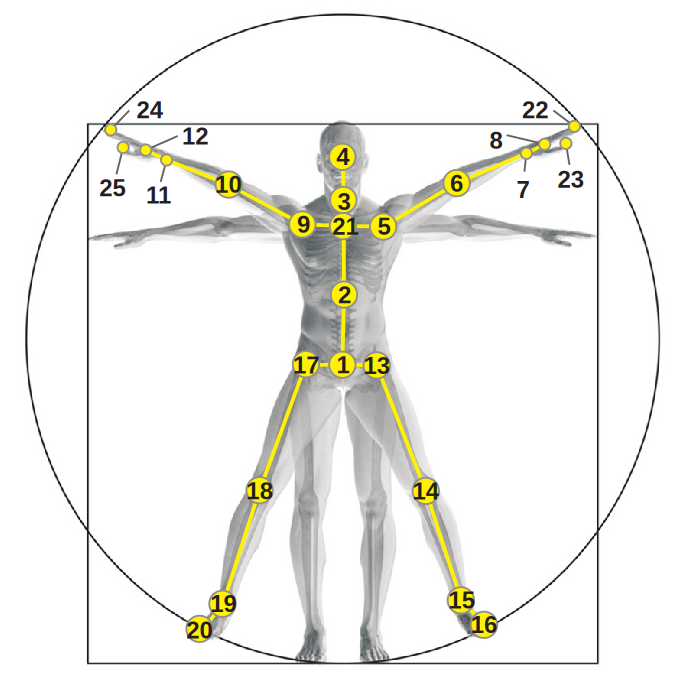
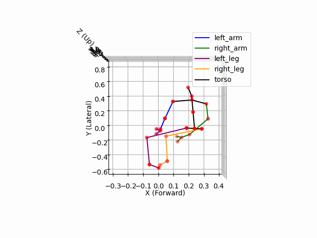

# Skeleton Data Reconstruction

This is a side project, which is designed to facilitate the visualization of human skeletal data for the purposes of observation and analysis.

The skeletal data was obtained from the `NTU RGB+D` dataset, which is available for download on [Github](https://github.com/shahroudy/NTURGB-D). Additional sources will be added in the future if necessary. The joint information is presented in the following figure. It is highly recommended to refer to the [original paper](https://ieeexplore.ieee.org/document/7780484) and the [website](https://rose1.ntu.edu.sg/dataset/actionRecognition/) for more details.

Cite from [NTU RGB+D: A Large Scale Dataset for 3D Human Activity Analysis](https://ieeexplore.ieee.org/document/7780484)

## Method

Matplotlib and Blener are the two main approaches to reconstruct the skeleton data.

### Matplotlib

